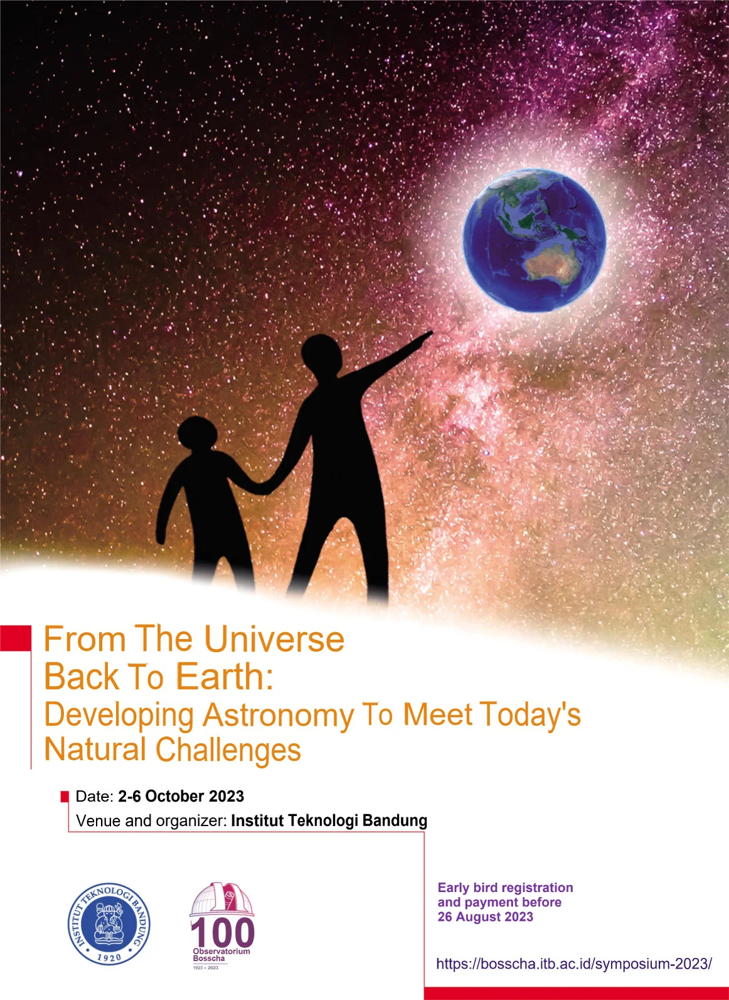

    <b>PDF Version:</b> <a href="files/Symposium-2023-poster.pdf" target="_blank" class="tombol tombol3">Download</a>
    <!-- <h4><a href="files/Symposium-2023-poster.pdf" target="_blank" class="button">Download the PDF Version</a></h4> -->
    

<!-- 

    

        
    

    

    <h4>PDF Version</h4>
    

  

    

      
    

    

      
Lorem ipsum.

    

  

 -->

