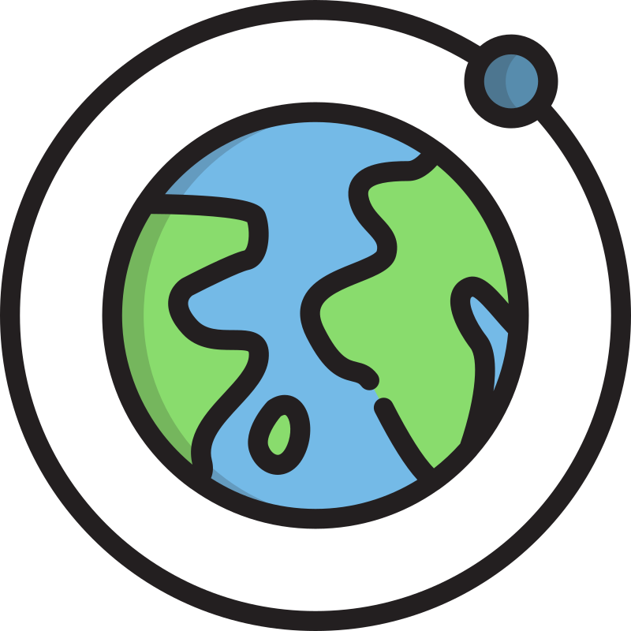

<!-- 
 -->
  

      

          <!--  -->
          
      

      

          <!-- <h4>Find rewarding projects</h4> -->
      <h4 class="subheading">Using the science of astronomy and astrophysics to understand the Earth system.</h4>
      
Nunc luctus vel nulla in semper. Aenean faucibus sodales fringilla. Cras aliquam tincidunt ex, ac elementum risus sodales ac. Curabitur augue libero, sagittis ut nulla id, dapibus scelerisque tellus. Aenean commodo et ligula id sagittis. Suspendisse et blandit tellus, sed pulvinar ligula. Phasellus tristique justo massa. Nam vestibulum dignissim neque accumsan posuere. In hac habitasse platea dictumst. Vivamus feugiat, libero non feugiat ornare, lacus erat suscipit arcu, sed consequat ipsum urna ut odio.

      

  

  

      

          
      

      

          <!-- <h4>Get hired quickly</h4> -->
          <h4 class="subheading">The Sun and Space Weather.</h4>
          
Nunc luctus vel nulla in semper. Aenean faucibus sodales fringilla. Cras aliquam tincidunt ex, ac elementum risus sodales ac. Curabitur augue libero, sagittis ut nulla id, dapibus scelerisque tellus. Aenean commodo et ligula id sagittis. Suspendisse et blandit tellus, sed pulvinar ligula. Phasellus tristique justo massa. Nam vestibulum dignissim neque accumsan posuere. In hac habitasse platea dictumst. Vivamus feugiat, libero non feugiat ornare, lacus erat suscipit arcu, sed consequat ipsum urna ut odio.

      

  

  

      

            
      

      

          <!-- <h4>Work efficiently, effectively.</h4> -->
          <h4 class="subheading">Using facilities, technologies, and data science in astronomy to study Earth system.</h4>
          
Nunc luctus vel nulla in semper. Aenean faucibus sodales fringilla. Cras aliquam tincidunt ex, ac elementum risus sodales ac. Curabitur augue libero, sagittis ut nulla id, dapibus scelerisque tellus. Aenean commodo et ligula id sagittis. Suspendisse et blandit tellus, sed pulvinar ligula. Phasellus tristique justo massa. Nam vestibulum dignissim neque accumsan posuere. In hac habitasse platea dictumst. Vivamus feugiat, libero non feugiat ornare, lacus erat suscipit arcu, sed consequat ipsum urna ut odio.

      

  

  

      

          
      

      

          <!-- <h4>Get paid on time</h4> -->
          <h4 class="subheading">Capacity building and network strategies: using astronomy to meet today’s natural challenges.</h4>
          
Nunc luctus vel nulla in semper. Aenean faucibus sodales fringilla. Cras aliquam tincidunt ex, ac elementum risus sodales ac. Curabitur augue libero, sagittis ut nulla id, dapibus scelerisque tellus. Aenean commodo et ligula id sagittis. Suspendisse et blandit tellus, sed pulvinar ligula. Phasellus tristique justo massa. Nam vestibulum dignissim neque accumsan posuere. In hac habitasse platea dictumst. Vivamus feugiat, libero non feugiat ornare, lacus erat suscipit arcu, sed consequat ipsum urna ut odio.

      

  

  

      

          
      

      

          <!-- <h4>Get paid on time</h4> -->
          <h4 class="subheading">Science Technology Engineering Arts and Mathematics (STEAM) Education of the Earth system: material, delivery strategy for young generation.</h4>
          
Nunc luctus vel nulla in semper. Aenean faucibus sodales fringilla. Cras aliquam tincidunt ex, ac elementum risus sodales ac. Curabitur augue libero, sagittis ut nulla id, dapibus scelerisque tellus. Aenean commodo et ligula id sagittis. Suspendisse et blandit tellus, sed pulvinar ligula. Phasellus tristique justo massa. Nam vestibulum dignissim neque accumsan posuere. In hac habitasse platea dictumst. Vivamus feugiat, libero non feugiat ornare, lacus erat suscipit arcu, sed consequat ipsum urna ut odio.

      

  

  

      

          
      

      

          <!-- <h4>Get paid on time</h4> -->
          <h4 class="subheading">Citizen science programmes.</h4>
          
Nunc luctus vel nulla in semper. Aenean faucibus sodales fringilla. Cras aliquam tincidunt ex, ac elementum risus sodales ac. Curabitur augue libero, sagittis ut nulla id, dapibus scelerisque tellus. Aenean commodo et ligula id sagittis. Suspendisse et blandit tellus, sed pulvinar ligula. Phasellus tristique justo massa. Nam vestibulum dignissim neque accumsan posuere. In hac habitasse platea dictumst. Vivamus feugiat, libero non feugiat ornare, lacus erat suscipit arcu, sed consequat ipsum urna ut odio.

      

  

<!-- 
 -->